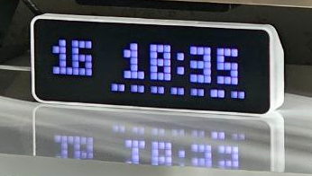

## Introduction

[**EspHoMaTriXv2**](https://github.com/lubeda/EspHoMaTriXv2) is a flexible, highly customizable DIY LED Matrix display, built with a 8×32 RGB LED panel and implemented with [esphome.io](https://esphome.io)



!!! info "EspHoMaTriXv2 Documentation"
    Full documentation with all the nuances is available in the [**EspHoMaTriXv2**](https://github.com/lubeda/EspHoMaTriXv2) component repository.


## Fonts

Pixel Clock uses TTF-font from [Trip5](https://github.com/trip5/Matrix-Fonts).

## Configuration

This component is highly customizable.

### Example

!!! example annotate "EspHoMaTriX Configuration"

    ``` { .yaml .copy .annotate }
    ehmtxv2:
      id: rgb8x32
      show_seconds: true
      advanced_clock: false
      matrix_component: ehmtx_display
      time_component: ehmtx_time
      icons2html: true
      iconscache: true
      default_font_id: default_font
      default_font_yoffset: 6
      special_font_id: special_font
      special_font_yoffset: 7
      brightness: 80 # percent
      time_format: "%H:%M"
      date_format: "%d.%m."
      rtl: false # write vom left to right
      vertical_scroll: false
      week_start_monday: true # false equals sunday
      scroll_count: 2 # scroll long text at least two times
      scroll_interval: 80 # milliseconds
      rainbow_interval: 32 # milliseconds
      icons: (1)
        ...
    ```
1. See [Icons and Animations](#icons-and-animations)

### Parameters reference

**id** (required, ID): Manually specify the ID used for code generation and in service definitions.

**date_format** (optional, string): formats the date display with [strftime syntax](https://esphome.io/components/time.html?highlight=strftime), defaults `"%d.%m."` (use `"%m.%d."` for the US)

**date_format_big** (optional, string): formats the date display with [strftime syntax](https://esphome.io/components/time.html?highlight=strftime), defaults `"%d.%m."` (use `"%m.%d."` for the US), works only in **advanced_clock** mode and sets the time format for a screen with a date without an icon

**show_seconds** (optional, boolean): toggle/blink an indicator-pixel each seconds while the clock is displayed (default: false)

**time_format** (optional, string): formats the time display with [strftime syntax](https://esphome.io/components/time.html?highlight=strftime), defaults `"%H:%M"` (use `"%I:%M%p"` for the US)

**time_format_big** (optional, string): formats the date display with [strftime syntax](https://esphome.io/components/time.html?highlight=strftime), defaults `"%H:%M:%S"`, works only in **advanced_clock** mode and sets the time format for a screen with a clock without an icon

**flip_flop_clock** (optional, boolean): Enables or disables flip_flop_clock clock mode. (default: false), works only in **advanced_clock** mode.

**flip_flop_speed** (optional, int): Set flip_flop_clock speed. (default: 2, range 1..10), works only in **advanced_clock** mode.

**advanced_clock** (optional, boolean): Enables or disables advanced clock mode. (default: false) You can specify the color for hours,minuted,seconds in RGB separatly: `set_adv_clock_color(hr, hg, hb, mr, mg, mb, sr, sg, sb)` [More info](https://github.com/lubeda/EspHoMaTriXv2/issues/164)

**advanced_bitmap**  (optional, boolean): Enables or disables advanced bitmap mode. (default: false)

!!! note
    Enables advanced mode of Bitmap screen (MODE_BITMAP_SCREEN), allows the use of [screen identifiers](#screen-id), which in turn makes it possible to display more than one Bitmap screen on the clock. But it can also increase RAM consumption, each screen + 256 bytes.

    !!! example annotate "Enable advanced bitmap mode"

        ``` { .yaml .copy .annotate }
        ehmtxv2:
          advanced_bitmap: true
        ```

    It is also possible to specify the required brightness when displaying a given Bitmap screen (MODE_BITMAP_SCREEN).
    !!! example annotate "Advanced bitmap usage"
        ``` { .yaml .copy .annotate }
        icon: [....]|screen_id#    - Brightness 240 (Default)
        icon: [....]|screen_id#200 - Brightness 200
        ```

**default_font_yoffset** (optional, pixel): yoffset the text is aligned BASELINE_LEFT, the baseline defaults to `6`

**default_font_xoffset** (optional, pixel): xoffset the text is aligned BASELINE_LEFT, the left defaults to `1`

**special_font_yoffset** (optional, pixel): yoffset the text is aligned BASELINE_LEFT, the baseline defaults to `6`

**special_font_xoffset** (optional, pixel): xoffset the text is aligned BASELINE_LEFT, the left defaults to `1`

**scroll_small_text** (optional, boolean): normally small text is centered on the display if possible, with this set to `true` even small text is scrolled in `text_screen` and `rainbow_text_screen` (default: false)

**vertical_scroll** (optional, boolean): If true, the screen change is vertical scrolling. Default is `false`

**matrix_component** (required, ID): ID of the addressable display

**show_dow** (optional, boolean): draw the day of week rindicator on the bottom of the clock screen. Disable, e.g., if you want larger fonts, defaults to true.

**blend_steps** (optional, int): on screen transition you can blend in the new screen, a value of 16, 32, 64 works nice, defaults 0. The `blend_steps` is proportionally reduced depending on the brightness, from the maximum specified in the configuration to half its value at a brightness of 50 units. If the brightness is less than 50 units, then the blend_steps is not applied.

**time_component** (required, ID): ID of the time component. The display shows `!t!` until the time source is valid.

**default_font** (required, ID): ID of the default font

**special_font** (required, ID): ID of the special font, you can reuse your default font, but occasionally, it's nice to have a special font to minimize scrolling

**week_start_monday** (optional, boolen): default Monday is first day of week, false => Sunday

**weekdays** (optional, string, default: "SUMOTUWETHFRSA"): Abbreviations of the days of the week, starting from Sunday, from *7 to 14* characters.

!!! example annotate "Weekdays example"

    ``` { .yaml .copy .annotate }
    - `weekdays: "SUMOTUWETHFRSA"`
    - `weekdays: "일월화수목금토"`
    - `weekdays: "НДПНВТСРЧТПТСБ"`
    - `weekdays: "DiLuMaMeJeVeSa" # french`
    ```

**scroll_interval** (optional, ms): the interval in ms to scroll the text (default=80), should be a multiple of the `update_interval` of [display](https://esphome.io/components/display/addressable_light.html)

**rainbow_shimmer** (optional, boolean): If true, enables color shimmer when displaying text in rainbow modes.

**multicolor_text** (optional, boolean): If true, enables text multi color support when displaying text.

!!! example annotate "Enable multi color text"

    ``` { .yaml .copy .annotate }
    ehmtxv2:
      id: rgb8x32
    ...
      multicolor_text: true
    ```

!!! example annotate "Show Multi color text from Home Assistant"

    ``` { .yaml .copy .annotate }
    service: esphome.pixel_clock_text_screen
    data:
      default_font: true
      text: "Default Color Text #00FF00Green Color Text #FF0000Red Color Text #0000FFBlue Color Text #000000Default Color Text"
      lifetime: 2
      screen_time: 10
      r: 255
      g: 255
      b: 255
    ```
Shows text in different colors, `Default Color Text` in the default color `#FFFFFF` (r: 255, g:255, b: 255), followed by `Green Color Text` in green `#00FF00`, then `Red Color Text` in red `#FF0000`, then `Blue Color Text` in blue `#0000FF` and finally `Default Color Text` in default color, due `#000000`.

!!! warning
    In this mode, with a large number of color changes, or with long lines, a short-term decrease in performance is possible.
    
    !!! quote "Log"

        ```
        [13:26:02][W][component:237]: Component display took a long time for an operation (55 ms).
        [13:26:02][W][component:238]: Components should block for at most 30 ms.
        ```

**boot_logo** (optional, string , only on ESP32): Allows you to show a custom boot logo instead of the default animation when booting.

!!! note
    - **advanced_boot** is **disabled**, then display a fullscreen logo defined as rgb565 array for `boot_logo_mode` 0/1 or a binary array for the other `boot_logo_modes`.
    - **advanced_boot** is **enabled**, then the mask is defined here as rgb565 array used to display boot logo, color is entirely ignored, output depends on boot logo display mode.

**advanced_boot** (optional, boolean, only on ESP32, Default: false) Enables advanced mode of boot logo display.

**boot_logo_mode** (optional, integer, only on ESP32, Default: 0) Mode of displaying boot logo, can take value from 0 to 7:

!!! abstract "Boot modes"
    - 0 - Display the boot_logo with the defined colors (default)
    - 1 - Display the boot_logo with the defined colors, the logo appears from the center to the sides.
    - 2 - Display boot_logo in white color
    - 3 - Display boot_logo in white color, the mask appears from the center to the sides.
    - 4 - Display boot_logo with rainbow color
    - 5 - Display boot_logo in rainbow color, the mask appears from the center to the sides
    - 6 - Display boot_logo in white color, in pseudo-animation mode, this mode for true starship astronavigators.
    - 7 - Display boot_logo in rainbow color, in pseudo-animation mode, this mode for true starship astronavigators.

!!! note 
    Mode 3 is best used with the option

    ``` { .yaml .copy .annotate }
    display:
      auto_clear_enabled: false
    ```

!!! note
    After startup, to save memory, you can clear the array with the boot logo by calling the `boot_logo` setup function with an empty parameter.

    ``` { .cpp .copy .annotate }
    id(rgb8x32)->set_boot_logo("");
    ```

`Mode 6,7` - True starship astronavigator modes.
Each element of the image mask array can take values from 0 to 255 (if the value is greater than 255, it is automatically reset to 255). 
Each pixel is output depending on the bit that is set in its value byte, for example:

!!! abstract
    - `1`   - `10000000` - Will be displayed at every 1 cycle of the boot logo image output.
    - `4`   - `00100000` - Will be displayed at every 3 cycle of the boot logo image output.
    - `255` - `11111111` - Will be displayed at each cycle of the boot logo image output.

**night_mode_screens** (optional, screen array, default [2, 3, 16]): List of screens displayed in `night mode`.

!!! note annotate
    When `night mode` is enabled, only the screens (1) specified in `night_mode_screens` are displayed (**default:** 2, 3, 16) the other screens can be added, deleted, and will follow their life cycle but will not be displayed. { .annotate }
    Services:
    - `night_mode_on` - turn `night mode` on
    - `night_mode_off` - turn `night mode` off

1. Screen numbers in the table [mode](#screens-and-modes).

**icon_indicator_screens** (optional, screen array, default [15, 18]): List of screens on which the `icon indicator` will be displayed.

!!! note annotate
    Shows the line indicator in the Icons area on the specified screens (1), in the specified color and at the specified vertical position. { .annotate }

    !!! example "Icon indicator screens confuguration"

        ``` { .yaml .copy .annotate }
        ehmtxv2:
        ...
          icon_indicator_screens:
            - 15
        ```

    !!! example "Home assistant service call"

        ``` { .yaml .copy .annotate }
        service: esphome.pixel_clock_show_icon_indicator
        data:
          r: 240
          g: 240
          b: 240
          size: 6
          pos: 7
          height: 1
        ```
1. Screen numbers in the table [mode](#screens-and-modes).

**icons2html** (optional, boolean): If true, generate the HTML-file (*filename*.html) to show all included icons. (default = `false`)

**iconscache** (optional, boolean): If true, it caches icons in the `.cache\icons` folder and if it finds the specified icons in the cache, it uses them instead of trying to download them again from the Internet. (default = `false`)

**always_show_rl_indicators** (optional, boolean): If true, always show the r/l indicators on all screens. The default is to not show either on clock, date, full, and bitmap screens, left on icon, or if display gauge displayed. (default = `false`)

**right_center_indicator** (optional, boolean, default: false): Controls the ability to use the right center indicator.

**right_bottom_indicator** (optional, boolean, default: true): Controls the ability to use the right bottom indicator.

**left_top_indicator** (optional, boolean, default: false): Controls the ability to use the left top indicator.

**left_center_indicator** (optional, boolean, default: false): Controls the ability to use the left center indicator.

**left_bottom_indicator** (optional, boolean, default: true): Controls the ability to use the left bottom indicator.

**icon_indicator** (optional, boolean, default: true): Controls the ability to use the icon indicator.

**gauge** (optional, boolean, default: true): Controls the ability to use the gauge indicator.

**fire_screen** (optional, boolean, default: true): Controls the ability to use the fire screen.

## Screens and Modes

Screen|Mode|Value|
|----|----|----|
|blank_screen|MODE_BLANK| 1|
|clock_screen|MODE_CLOCK| 2|
|date_screen|MODE_DATE| 3|
|full_screen|MODE_FULL_SCREEN| 4|
|icon_screen|MODE_ICON_SCREEN| 5|
|text_screen|MODE_TEXT_SCREEN| 6|
|rainbow_icon_screen|MODE_RAINBOW_ICON| 7|
|rainbow_text_screen|MODE_RAINBOW_TEXT| 8|
|rainbow_clock_screen|MODE_RAINBOW_CLOCK| 9|
|rainbow_date_screen|MODE_RAINBOW_DATE| 10|
|bitmap_screen|MODE_BITMAP_SCREEN| 11|
|bitmap_small|MODE_BITMAP_SMALL| 12|
|color_screen|MODE_COLOR| 13|
|fire_screen|MODE_FIRE| 14|
|icon_clock|MODE_ICON_CLOCK| 15|
|alert_screen|MODE_ALERT_SCREEN| 16|
|set_graph|MODE_GRAPH_SCREEN| 17|
|icon_date|MODE_ICON_DATE| 18|
|icon_screen_progress|[MODE_ICON_PROGRESS](screens.md#mode_icon_progress)| 19|
|rainbow_bitmap_small|MODE_RAINBOW_BITMAP_SMALL| 20|
|icon_text_screen|MODE_ICON_TEXT_SCREEN| 21|
|rainbow_icon_text_screen|MODE_RAINBOW_ICON_TEXT_SCREEN| 22|
|bitmap_stack|MODE_BITMAP_STACK_SCREEN| 23|
|text_screen_progress|MODE_TEXT_PROGRESS| 24|
|icon_prognosis_screen|[MODE_PROGNOSIS_SCREEN](screens.md#mode_prognosis_screen)| 25|
|rainbow_alert_screen|MODE_RAINBOW_ALERT_SCREEN| 26|

## Icons and Animations

Download and install all needed icons `(.jpg/.png)` and animations `(.gif)` under the `matrix_lamp:` key. All icons have to be 8x8 pixels in size. If necessary, you can scale them with the option `resize: 8x8`.

You can also specify a URL to directly download the image file. The URLs will only be downloaded once at compile time, so there is no additional traffic on the hosting website.

All other solutions provide ready-made icons, especially **Lametric** has a big database of [icons](https://developer.lametric.com/icons). If you find an icon, you can use it with its ID. e.g., `lameid: 1234`.

!!! note
    Please, check the copyright of the icons you use. 

!!! note
    The maximum number of icons is limited to **100** in the code and also by the flash space and the RAM of your board.

!!! example annotate "Icons and Animations"

    ``` { .yaml .copy .annotate }
    matrix_lamp:
      display: ...
      icons: 
        - id: boot 
          file: icons/rocket.GIF
          duration: 75     
        - id: temp 
          lameid: 1234
        - id: yoga
          file: icons/yoga-bridge.GIF
          pingpong: true
        - id: jackshome
          url: https://awtrix.blueforcer.de/animations/JackHomePage
          resize: 32x8
        - id: garage
          lameid: 1234
          duration: 100
        - id: homeassistant
          url: https://github.com/home-assistant/assets/raw/master/logo/logo-special.png      
    ```

### Parameters reference

The ID of the icons is used later to icon display. So, you should name them wisely. 

!!! tip
    If you like to group icons, you should prefix them, e.g., with `weather_`.

There are some more advanced parameters:

- **frame_duration** (optional, `ms`): in the case of a GIF-file, the component tries to read the default interval for each frame. The default/fallback interval is 192 ms. In case you need to override the default value, set the duration per icon.

- **pingpong** (optional, `boolean`): in the case of a GIF-file, you can reverse the frames instead of starting from the first frame.

- **file** (Exclusive, `filename`): a local filename

- **url** (Exclusive, `url`): a URL to download the icon

- **lameid** (Exclusive, `number`): the ID from the **LaMetric** [icon](https://developer.lametric.com/icons) database

- **resize** (Optional, `8x8` or `8x32`): If the source file hasn't the right dimensions.

!!! example annotate "Icons resize"

    ``` { .yaml .copy .annotate }
        - id: jackshome
          url: https://awtrix.blueforcer.de/animations/JackHomePage
          resize: 8x32
    ```

## Public Functions / Services

Numerous features are accessible with services from home assistant and lambdas that you can use in your YAML.

|Service|Parameter|Description|
|---|---|---|
|get_status|none|write some status information to the esphome logs|
|display_on|none|turn display off|
|display_off|none|turn display on|
|hold_screen|none|show the screen that is currently displayed for the number of seconds longer|
|hide_rindicator|none|hides the rindicator|
|hide_gauge|none|hides the gauge|
|hide_alarm|none|hides the alarm|
|night_mode_on|none|turn night mode on|
|night_mode_off|none|turn night mode off|
|show_gauge|"percent", "r", "g", "b"|set the height of the gauge according to the percentage in the given color|
|show_alarm|"r", "g", "b", "size"|shows the color with the given size in the upper-right corner|
|show_rcindicator|"r", "g", "b", "size"|shows the color with the given size in the center-right|
|show_rindicator|"r", "g", "b", "size"|shows the color with the given size in the lower-right corner|
|show_ltindicator|"r", "g", "b", "size"|shows the color with the given size in the top-left corner|
|show_lcindicator|"r", "g", "b", "size"|shows the color with the given size in the center-left|
|show_lindicator|"r", "g", "b", "size"|shows the color with the given size in the lower-left corner|
|set_today_color|"r", "g", "b"|set the special color for today in the day of week line|
|set_weekday_color|"r", "g", "b"|set the default color in the day of week line|
|set_clock_color|"r", "g", "b"|set the default color of clock and date display|
|set_solid_color|"r", "g", "b"|set the color for solid pseudo icon|
|set_calendar_color|"r", "g", "b"|set the header color for calendar pseudo icon|
|set_weekday_accent_on|none|turns on the display of small days (accent) of the week when brightness is insufficient|
|set_weekday_accent_off|none|turns off the display of small days (accent) of the week when brightness is insufficient|
|del_screen|"icon_name", “mode”|deletes the specified icon screen from the queue, the [mode](#screens-and-modes) is a filter|
|force_screen|"icon_name", “mode”|displays the selected the specified icon screen from the queue, the [mode](#screens-and-modes) is a filter|
|full_screen|"icon_name", "lifetime", "screen_time"|show the specified 8x32 icon as full screen|
|icon_screen|"icon_name", "text", "lifetime", "screen_time", "default_font", "r", "g", "b"|show the specified icon with text|
|rainbow_icon_screen|"icon_name", "text", "lifetime", "screen_time", "default_font"|show the specified icon with text in rainbow color|
|text_screen|"text", "lifetime", "screen_time", "default_font", "r", "g", "b"|show the specified text|
|rainbow_text_screen|"text", "lifetime", "screen_time", "default_font"|show the specified text in rainbow colors|
|clock_screen|"lifetime", "screen_time", "default_font", "r", "g", "b"|show the clock|
|rainbow_clock_screen|"lifetime", "screen_time", "default_font"|show the clock in rainbow color|
|blank_screen|"lifetime", "screen_time"|"show" an empty screen|
|date_screen|"lifetime", "screen_time", "default_font", "r", "g", "b"|show the date|
|brightness|"value"|set the display brightness|
|alert_screen|"icon_name", "text", "screen_time", "default_font", "r", "g", "b"|show the specified icon with text, screen forced and lifetime = screen_time|
|rainbow_alert_screen|"icon_name", "text", "screen_time", "default_font"|show the specified icon with text in rainbow color, screen forced and lifetime = screen_time|
|icon_screen_progress|"icon_name", "text", "progress", "lifetime", "screen_time", "default_font", "r", "g", "b"|show the specified icon with text and with progress bar on bottom|
|set_progressbar_color|"icon_name", "mode", "r", "g", "b", "bg_r", "bg_g", "bg_b"|sets the specified by name and [mode](#screens-and-modes) screen with progress bar, the specified color of the progress bar, and the background color of the progress bar. if you set the color to black, the color display will work according to the progress value|
|icon_clock|"icon_name", "lifetime", "screen_time", "default_font", "r", "g", "b"|show the specified icon with time, there is support for [displaying text on top of the icon](#icon-text)|
|icon_date|"icon_name", "lifetime", "screen_time", "default_font", "r", "g", "b"|show the specified icon with date, there is support for [displaying text on top of the icon](#icon-text)|
|graph_screen|"lifetime", "screen_time"|show graph as defined in the YAML file|
|icon_graph_screen|"icon_name", "lifetime", "screen_time"|show the specified icon with graph as defined in the YAML file|
|set_infotext_color|"left_r", "left_g", "left_b", "right_r", "right_g", "right_b","default_font","y_offset"|set the special color for left and right char on info text|
|bitmap_small|"icon", "text", "lifetime", "screen_time", "default_font", "r", "g", "b"|show 8x8 image as text, and text|
|rainbow_bitmap_small|"icon", "text", "lifetime", "screen_time", "default_font"|show 8x8 image as text, and text in rainbow colors|
|icon_text_screen|"icon_name", "text", "lifetime", "screen_time", "default_font", "r", "g", "b"|show the specified icon with text and scroll icon along with long text|
|rainbow_icon_text_screen|"icon_name", "text", "lifetime", "screen_time", "default_font"|show the specified icon with text in rainbow color and scroll icon along with long text|
|bitmap_stack|"icons", "lifetime", "screen_time"|show or scroll from 1 to 64 icons described in the configuration|
|text_screen_progress|"text", "value", "progress", "lifetime", "screen_time", "default_font", "value_color_as_progress", "r", "g", "b"|show the specified short text with value and with progress bar on bottom|
|icon_prognosis_screen|"icon_name", "text", "prognosis", "lifetime", "screen_time", "default_font"|show an icon, text, and a prognosis bar consisting of 24 dots of specified colors|
|icon_prognosis_screen_rgb|"icon_name", "text", "prognosis", "lifetime", "screen_time", "default_font", "r", "g", "b"|show an icon, text, and a prognosis bar consisting of 24 dots of specified colors|
|set_adv_clock_color|"hr", "hg", "hb", "mr", "mg", "mb", "sr", "sg", "sb"|available only in **advanced clock mode** `advanced_clock: true`, allows you to set the color for the Hours (hr, hg, hb), Minutes (mr, mg, mb) and Spacer (sr, sg, sb), color is set by analogy with `r,g,b`. If the color is set as `black`, the standard color is used (see `set_clock_color`).|
|set_clock_infotext_color|"left_r", "left_g", "left_b", "right_r", "right_g", "right_b","default_font","y_offset"|set the special color for left and right char on info text on `icon clock` screen, work only in **advanced clock mode**|
|set_date_infotext_color|"left_r", "left_g", "left_b", "right_r", "right_g", "right_b","default_font","y_offset"|set the special color for left and right char on info text on `icon date` screen, work only in **advanced clock mode**|
|show_icon_indicator|"r", "g", "b", "size", "pos", "height"|shows the line indicator in the Icons area on the specified screens, in the specified color and at the specified vertical position|
|hide_icon_indicator|none|hides the icon indicator|
|expand_icon_to_9|"mode"|Extends the icon display on the clock screen and date screen by one line (9 pixels wide). Mode 0 (default) - do not expand. Mode 1 - expand only on the clock screen. Mode 2 - expand only on the date screen. Mode 3 - expand on the screen with clock and on the screen with date. [More info](https://github.com/lubeda/EspHoMaTriXv2/pull/179)|

### Parameter description

- **r, g, b**: Color components for red, green, and blue 0..255
- **size**: The size of the corner indicator or alarm, 1-3, center indicator 1-4, icon_indicator 1-10
- **percent**: values from 0..100
- **icon_name**: the id of the icon to show, as defined in the YAML file (or pseudo-icon `blank` - empty icon, `solid` - solid icon, `calendar` - calendar icon), it is also possible to set the arbitrary [screen identifier](#screen-id), for example `icon_name|screen_id`
- **icons**: the list of id of the icon to show, as defined in the YAML file, like: icon1,icon2.
- **text**: a text message to display
- **lifetime**: how long does this screen stay in the queue (minutes)
- **screen_time**: how long is this screen display in the loop (seconds). For short text without scrolling it is shown the defined time, longer text is scrolled at least `scroll_count` times.
- **default_font**: use the default font (true) or the special font (false)
- **progress**: can take a value from -100 to 100, the color of the progress bar is calculated automatically, if no colors are specified in the function `set_progressbar_color`, then if the progress is in the range `0..100`, then `from red to green`, if in the range `-100..0`, then from `green to red`.
- **value_color_as_progress**: display the value with the color of the current color on the progress bar
- **value**: the brightness 0...255 
- **prognosis**: 24 triplets of digits (72 in total), each triplet, one point on the prognosis bar in the specified color in the triplet color. Like: [200,200,200, ..., 100,100,100] see [details](https://github.com/lubeda/EspHoMaTriXv2/issues/149)

## Advanced options

### Screen ID

Screen identifier allows you to display the same icons on the same screen type without overlapping each other, for example, weather and weather forecast:

!!! example annotate "Screen ID"

    ``` { .yaml .copy .annotate }
    - service: esphome.pixel_clock_icon_screen
      data:
        icon_name: "weather_{{ states('weather.current_weather') | replace('-','_') }}|weather"

    - service: esphome.pixel_clock_icon_screen
      data:
        icon_name: "weather_{{ states('weather.forecast_weather') | replace('-','_') }}|forecast"
    ```
If the screen identifier is specified, then all work on identification of the screen is carried out by it, as well as in functions like `del_screen`, `force_screen` it **will be necessary to specify it** and **not the name of the icon**.

!!! tip "Calling one screen with different identifiers"

    `icon_name: light|01`
    Show screen with icon `light` and screen_id `01`

    `icon_name: light|02`
    Show screen with icon `light` and screen_id `02`

    `icon_name: plant|01`
    Replace the icon on the screen (if it is still alive) with the screen_id `01` with the icon `plant`

    `icon_name: plant|02`
    Replace the icon on the screen (if it is still alive) with the screen_id `02` with the icon `plant`

    `icon_name: plant|03`
    Show screen with icon `plant` and screen_id `03`

### Icon Text

A common format for specifying output options: `icon|mode#draw_mode`
- `icon` - Icon from YAML that will be displayed
- `mode` - Mode, what will be displayed on the icon
- `draw_mode` - Mode how the text will be displayed on the icon

**mode** that are supported:
- `day` - Displays the current day of the month on the icon
- `weekday` - Displays the current day of the week on the icon 

**draw_mode** that are supported:
- 0 - default - To the edges
- 1 - To the center
- 2 - Left to center, Right to edge
- 3 - To the center, the left one is a pixel higher
- 4 - To the center, the right one is a pixel higher
- 5 - To the center, without leading 0 (**only for day**)

!!! tip
    More information at the [link](https://github.com/lubeda/EspHoMaTriXv2/issues/92#issuecomment-1750184472)

!!! example
    `calendar|day#1` - Show the `calendar` icon, display the current day of the month on it with the numbers centered.

## ESPHome configuration

### Arduino

!!! example annotate "Local configuration file | Arduino"

    ``` { .yaml .copy .annotate }
    substitutions:
      device: esp_pixel_clock
      name: pixel-clock
      friendly_name: ESPHome Pixel Clock
      project_name: "ajs.Pixel_Clock"
      project_version: "1.1.5"
      update_interval: 60s
      comment: "Ulanzi Pixel Clock | EHMTXv2"
      weekdays: "ВСПНВТСРЧТПТСБ"
      date_to: "ВС ПН ВТ СР ЧТ ПТ СБ Січ Лют Бер Кві Тра Чер Лип Сер Вер Жов Лис Гру"

    packages:
      common: !include packages/common.yaml (1)
      framework: !include packages/framework-arduino.yaml (2)
      pixel: !include packages/pixel_clock.yaml (3)
    ```
1. To successfully build this example, you need to download the [used packages](https://github.com/andrewjswan/pixel-clock/tree/main/packages) to the `packages` folder.
2. To successfully build this example, you need to download the [used packages](https://github.com/andrewjswan/pixel-clock/tree/main/packages) to the `packages` folder.
3. To successfully build this example, you need to download the [used packages](https://github.com/andrewjswan/pixel-clock/tree/main/packages) to the `packages` folder.

!!! tip
    To successfully build this example, you need to download the [used packages](https://github.com/andrewjswan/pixel-clock/tree/main/packages) to the `packages` folder.

### ESP-IDF

!!! example annotate "Local configuration file | ESP-IDF"

    ``` { .yaml .copy .annotate }
    substitutions:
      device: esp_pixel_clock
      name: pixel-clock
      friendly_name: ESPHome Pixel Clock
      project_name: "ajs.Pixel_Clock"
      project_version: "1.1.5"
      update_interval: 60s
      comment: "Ulanzi Pixel Clock | EHMTXv2"
      weekdays: "ВСПНВТСРЧТПТСБ"
      date_to: "ВС ПН ВТ СР ЧТ ПТ СБ Січ Лют Бер Кві Тра Чер Лип Сер Вер Жов Лис Гру"

    packages:
      common: !include packages/common.yaml (1)
      framework: !include packages/framework-esp-idf.yaml (2)
      pixel: !include packages/pixel_clock.yaml (3)
    ```
1. To successfully build this example, you need to download the [used packages](https://github.com/andrewjswan/pixel-clock/tree/main/packages) to the `packages` folder.
2. To successfully build this example, you need to download the [used packages](https://github.com/andrewjswan/pixel-clock/tree/main/packages) to the `packages` folder.
3. To successfully build this example, you need to download the [used packages](https://github.com/andrewjswan/pixel-clock/tree/main/packages) to the `packages` folder.

!!! tip
    To successfully build this example, you need to download the [used packages](https://github.com/andrewjswan/pixel-clock/tree/main/packages) to the `packages` folder.
