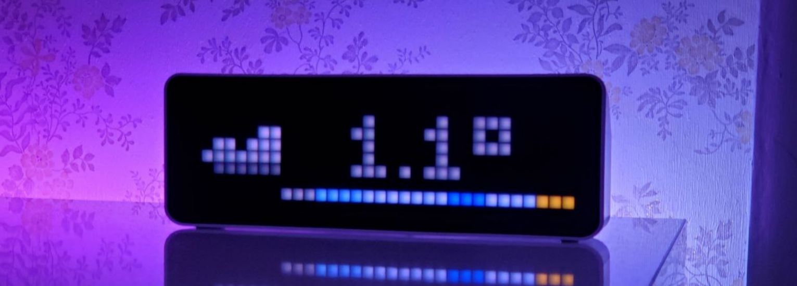

## MODE_ICON_PROGRESS


!!! example annotate "Icon screen progress"

    ``` { .yaml .copy .annotate }
    alias: Pixel Clock - Power
    trigger:
      - platform: state
        entity_id: sensor.home_power
        id: over
      - platform: numeric_state
        entity_id: sensor.home_power
        below: 5000
        id: normal
    condition:
      - condition: template
        value_template: >
          {{ trigger.id == 'normal' or (trigger.id == 'over' and states('sensor.home_power') | int(0) > 5000) }}
    action:
      - action: esphome.pixel_clock_icon_screen_progress
        data:
          icon_name: power
          text: "{{ (states('sensor.home_power') | int(0) / 1000) | round(1) }}kW"
          progress: "{{ -1 * (states('sensor.home_power') | int(0) / 100) | round(0) }}"
          lifetime: "{{ 5 if states('sensor.home_power') | int(0) > 1000 else 3 }}"
          screen_time: 5
          default_font: true
          r: >-
            {{
              240 if states('sensor.home_power') | int(0) > 5000 else
              240 if states('sensor.home_power') | int(0) > 1000 else
              0
            }}
          g: >-
            {{
              0 if states('sensor.home_power') | int(0) > 5000 else
              240 if states('sensor.home_power') | int(0) > 1000 else
              240
            }}
          b: 0
    mode: restart
    ```
## MODE_PROGNOSIS_SCREEN



!!! tip Home Assistant
    Additional examples and screenshots are available at the [link](https://github.com/lubeda/EspHoMaTriXv2/issues/149)
